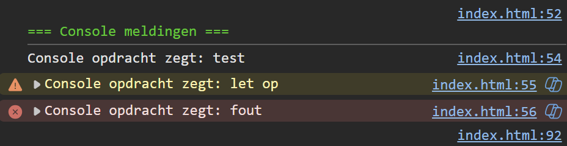

## Opdracht

1. toon de gewone melding "Console opdracht zegt: test" in de console
2. toon de waarschuwing "Console opdracht zegt: let op"
3. toon de foutmelding "Console opdracht zegt: fout"

## Screenshot

