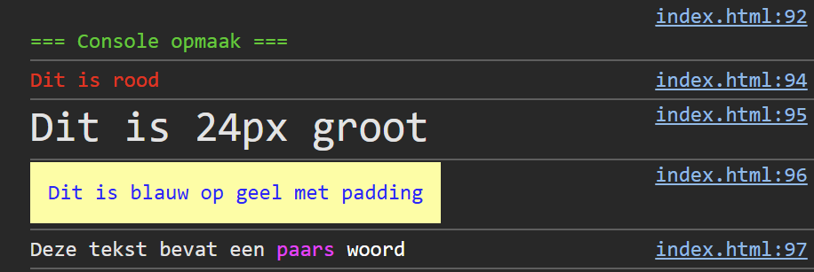

## Opdracht

1. Log een bericht "Dit is rood" in het rood.
2. Log een bericht "Dit is 24px groot" in 24px lettergrootte.
3. Log een bericht "Dit is blauw op geel met padding" met de juiste opmaak.
4. Log een bericht "Deze tekst bevat een paars woord", waarbij enkel het woord "paars" paars is (#ff00ff).

## Screenshot

