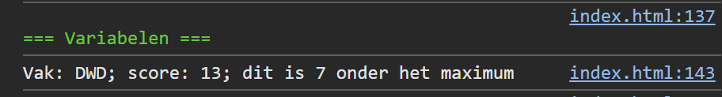

## Opdracht

1. maak een constante `vak` met waarde `DWD`
2. maak een variabele `punten` met waarde `8`
3. verhoog `punten` met 5 (gebruik bij voorkeur verkorte notatie)
4. definieer een constante `MAX_PUNTEN` met waarde `20`
5. toon het vak, het aantal punten en het aantal onder het maximum in de console

## Screenshot

