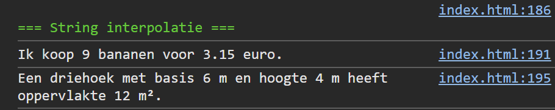

## Opdracht

1. Geef `product` de waarde `'bananen'`.
2. Geef `aantal` de waarde `9`.
3. Geef `stukprijs` de waarde `0.35`.
4. Log met interpolatie: `Ik koop [aantal] [product] voor [totaal] euro.` (gebruik een expressie voor het totaalbedrag).
5. Geef `basis` de waarde `6`.
6. Geef `hoogte` de waarde `4`.
7. Log met interpolatie: `Een driehoek met basis [basis] m en hoogte [hoogte] m heeft oppervlakte [oppervlakte] m².` (gebruik een expressie voor de oppervlakte: basis × hoogte ÷ 2).

## Screenshot

