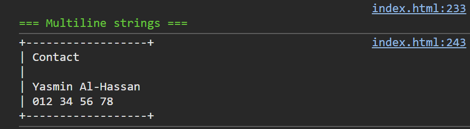

## Opdracht

1. Geef `naam` de waarde `'Yasmin Al-Hassan'`.
2. Geef `telefoon` de waarde `'012 34 56 78'`.
3. Maak een constante `kaartje` met een multiline string naar voorbeeld van de screenshot.
4. Toon het in de console.

## Screenshot

