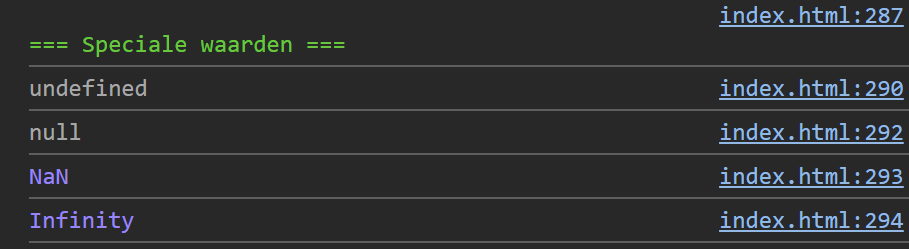

## Opdracht

1. Declareer een variabele `test` zonder waarde. Log `test` in de console.
2. Geef `b` de waarde `null`. Log `b`.
3. Log het resultaat van `parseInt('twaalf')`.
4. Log het resultaat van `Math.pow(10, 10000)`.

## Screenshot

