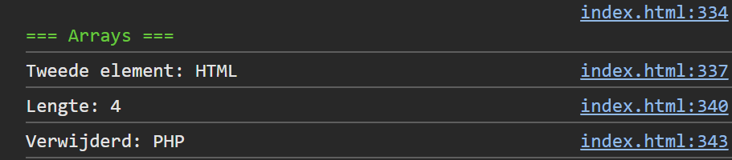

## Opdracht

1. Maak een array `vakken` met `'Javascript'`, `'HTML'` en `'CSS'`.
2. Toon het tweede element in de console.
3. Voeg `'PHP'` toe achteraan.
4. Toon de lengte van de array.
5. Verwijder het laatste element en toon wat er verwijderd werd.

## Screenshot

