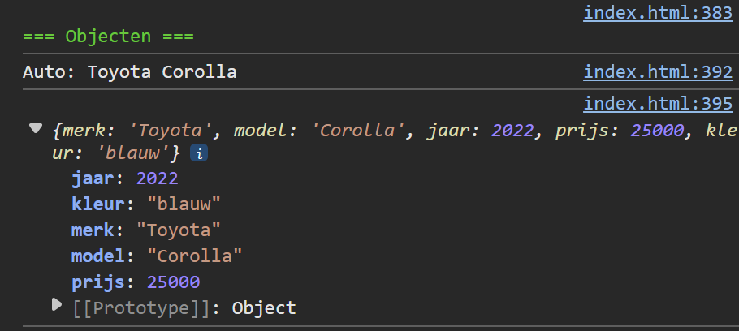

## Opdracht

1. Maak een object `auto` met properties: `merk`, `model`, `jaar` en `prijs`.
2. Toon het merk en model in één zin met string interpolatie.
3. Voeg een property `kleur` toe.
4. Toon het volledige object met `console.log()`.

## Screenshot

