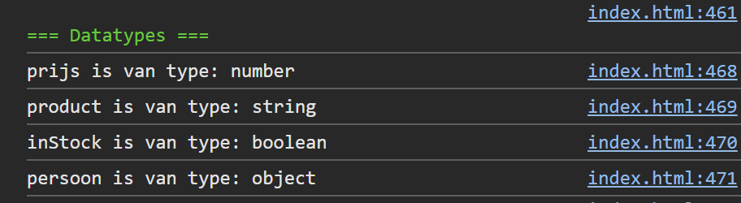

## Opdracht

1. Maak een variabele `prijs` met waarde `19.99`.
2. Maak een variabele `product` met waarde `'laptop'`.
3. Maak een variabele `inStock` met waarde `true`.
4. Maak een variabele `persoon` met waarde `{ naam: 'Jan' }`.
5. Toon het type van elke variabele in de console.

## Screenshot

