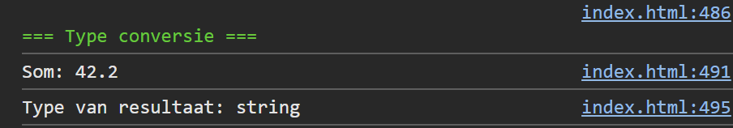

## Opdracht

1. Maak een variabele `input1` met waarde `'25.2'`.
2. Maak een variabele `input2` met waarde `'17'`.
3. Tel beide waarden op als getallen en toon het resultaat (moet `42.2` zijn, niet `'25.217'`).
4. Maak een variabele `resultaat` met waarde `100` en zet om naar string.
5. Toon het type van `resultaat` in de console.

## Screenshot

