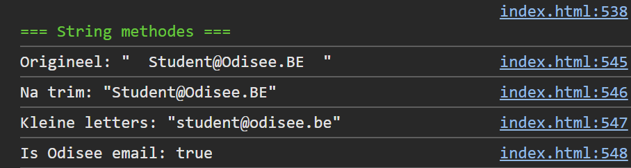

## Opdracht

1. Maak een variabele `email` met waarde `" Student@Odisee.BE "`.
2. Verwijder de spaties voor en achter met `trim()`.
3. Zet om naar kleine letters met `toLowerCase()`.
4. Controleer of het een Odisee-emailadres is met `includes()`.
5. Toon alle resultaten in de console.

## Screenshot

