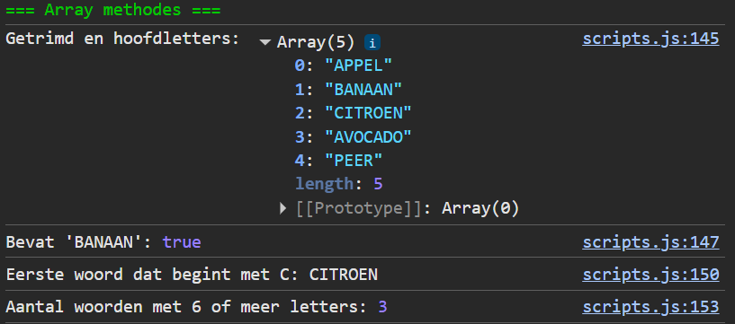

## Opdracht

1. Maak een array `woorden` met `['  appel ', 'banaan', 'citroen  ', ' avocado', 'peer']` (let op de spaties).
2. Trim alle woorden met `map()` en zet om in hoofdletters; wijs het resultaat opnieuw toe aan `woorden`. Log het resultaat.
3. Gebruik `includes()` om te controleren of de array `'BANAAN'` bevat. Log het resultaat.
4. Gebruik `find()` om het eerste woord te vinden dat begint met de letter `'C'`. Log het resultaat.
5. Bepaal het aantal woorden dat 6 of meer letters heeft: gebruik `map()` en `length` om elk woord om te zetten naar het aantal letters, gebruik dan `filter()` om de waarden groter dan of gelijk aan 6 te selecteren, en gebruik tenslotte `length` om het aantal te bepalen. Log dat aantal.

## Screenshot

