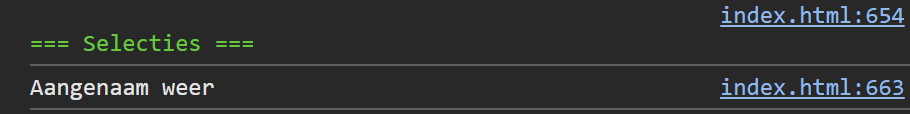

## Opdracht

1. Maak een variabele `temperatuur` met de waarde `18`.
2. Schrijf een if-else structuur die:
   - bij temperatuur < 0: `"Vrieskou!"` toont
   - bij temperatuur < 15: `"Koud weer"` toont
   - bij temperatuur < 25: `"Aangenaam weer"` toont
   - anders: `"Warm weer"` toont

## Screenshot

