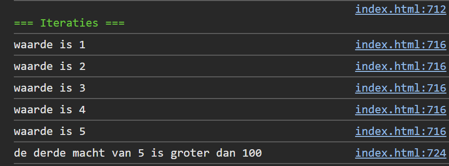

## Opdracht

1. Gebruik een `for`-loop om de getallen 1 tot en met 5 te loggen.
2. Gebruik een `do-while`-loop vanaf 1 om het eerste getal te vinden waarvan de derde macht groter is dan 100.

## Screenshot

