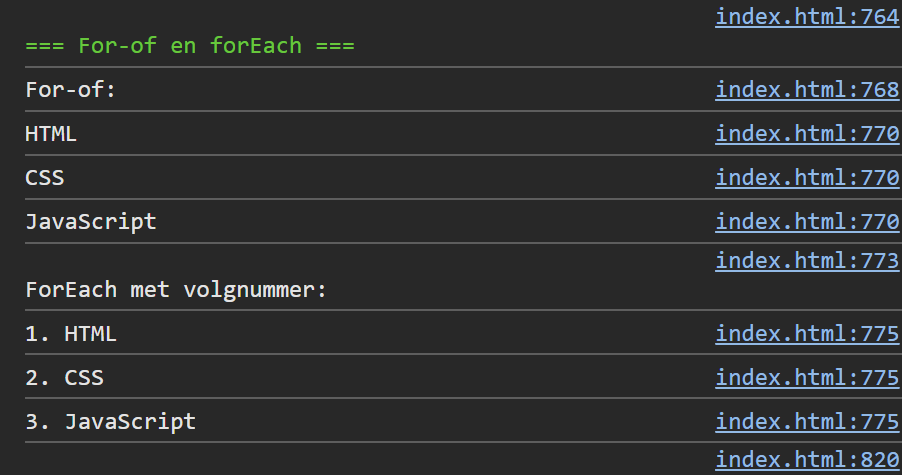

## Opdracht

1. Maak een array `vakken` met `['HTML', 'CSS', 'JavaScript']`.
2. Log elk vak met een `for-of` loop.
3. Gebruik `forEach` op `vakken` om elk vak met volgnummer te loggen (bv. `1. HTML`).

## Screenshot

