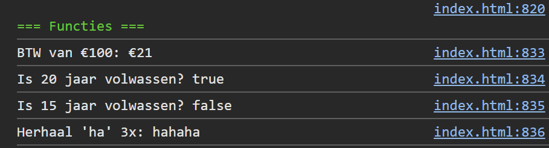

## Opdracht

1. Schrijf een functie `berekenBTW` die een prijs ontvangt en de BTW (21%) teruggeeft.
2. Schrijf een arrow function `isVolwassen` die een leeftijd ontvangt en `true`/`false` teruggeeft.
3. Schrijf een functie `herhaal` die een tekst en een aantal ontvangt, en de tekst dat aantal keer herhaalt.
4. Test alle functies en toon de resultaten.

## Screenshot

