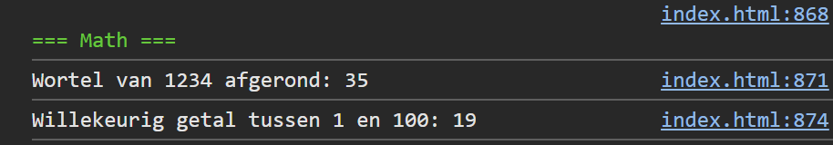

## Opdracht

1. Bereken de wortel van `1234` en toon het afgerond resultaat.
2. Genereer een willekeurig getal tussen 1 en 100: gebruik `Math.random()`, vermenigvuldig met 100 en rond af naar boven met `Math.ceil`.

## Screenshot

