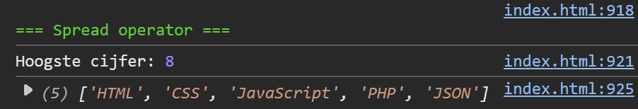

## Opdracht

1. Maak een string `getal` met waarde `'2587'`. Gebruik `Math.max(...getal)` om het hoogste cijfer in het getal te loggen.
2. Maak een array `vakken` met `['HTML', 'CSS', 'JavaScript']`. Voeg er met de spread operator de waarden `'PHP'` en `'JSON'` aan toe zonder `push()` en zonder een nieuwe array te maken. Log de array.

## Screenshot

