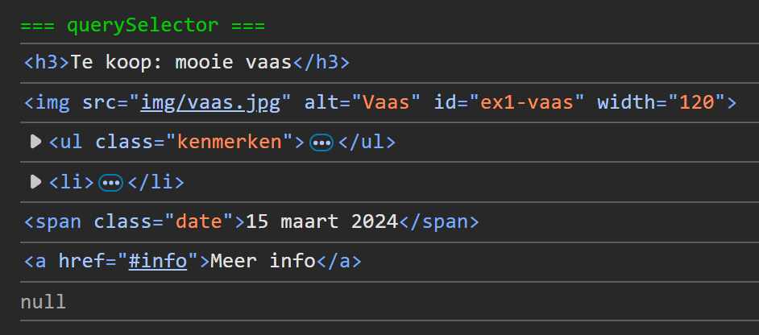

## Opdracht

Gebruik de inspector om de juiste CSS selector te vinden voor elk element in het HTML codefragment hieronder (blauw kader).
Declareer telkens een constante en log het resultaat in de console:

1. de titel (tag)
2. de afbeelding (id)
3. het lijstje (class of tag)
4. het tweede item in het lijstje (combinatie van class en nth-child)
5. de span met de datum (class)
6. de link in het lijstje (contextuele selector)
7. een tabel (tag, zal niet gevonden worden)

*tip: gebruik de `id="ex1-html"` van het codefragment als contextuele selector, dus `document.querySelector('#ex1 .html ...')`*.*

## Screenshot

