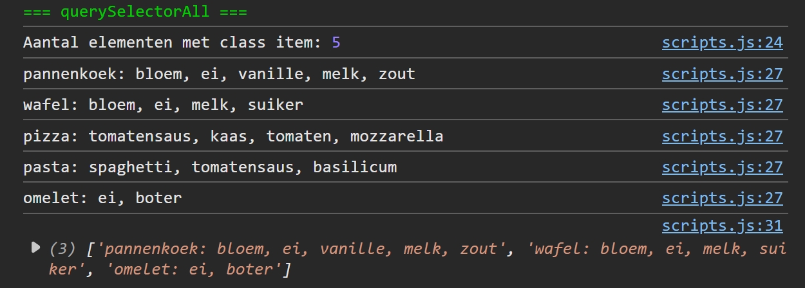

## Opdracht

Alle output komt in de console.

1. Selecteer alle elementen van de lijst via hun class-attribuut met document.querySelectorAll(); steek het resultaat in een constante. Log het aantal gevonden elementen.
2. Overloop het resultaat met een forEach en log voor elk element de tekstinhoud (innerText) in de console.
3. Maak in één regel een array met recepten die ei bevatten; log deze array in de console.
   → gebruik eerst de spread oparator om de NodeList te converteren naar een array.
   → gebruik dan map() elk element te mappen naar zijn innerText.
   → gebruik tenslotte filter() en de includes() string methode om de array te filteren op ' ei'.

## Screenshot

