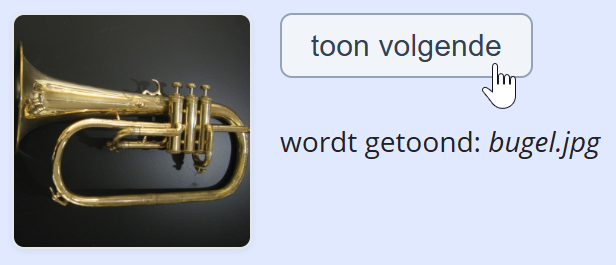
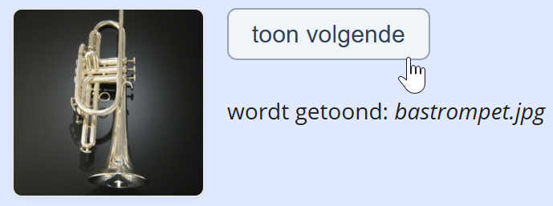

## Opdracht

Bij klik op de knop **toon volgende** moet telkens de volgende blazer worden getoond:

1. declareer een array met de vier blazer afbeeldingen (in de map *img*: `altsax.jpg`, `bastrompet.jpg`, `bugel.jpg`, `hoorn.jpg`)
2. declareer een variabele `index` om te onthouden welke momenteel getoond wordt
3. bij klik op de knop incrementeer je de index, en stel je de `src` attribuut van de afbeelding in met de volgende afbeelding uit de array
4. tenslotte toon je de bestandsnaam van de huidige afbeelding in het uitvoergebied

## Screenshots

