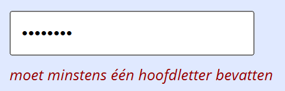

## Opdracht 1 — letters en spaties

In het bovenste tekstvak mogen **alleen letters en spaties** ingevoerd worden; andere tekens worden verwijderd.

Baseer je op dit fragment:

```js
let tekst = '...van papier, 1,2,3,4 -hoedje van!';
tekst = tekst.replace(/[^a-zA-Z\s]/g, ''); // 'van papier hoedje van'
```

## Opdracht 2 — wachtwoordvalidatie

Toon tijdens het typen foutmeldingen zolang het wachtwoord niet correct is:

- minder dan 8 tekens: toon "moet minstens 8 tekens bevatten"
- geen hoofdletter (controleer met `/[A-Z]/.test(...)`): toon "moet minstens één hoofdletter bevatten"
- geen cijfer (controleer met `/[0-9]/.test(...)`): toon "moet minstens één cijfer bevatten"

Zolang aan alle eisen is voldaan of de tekst leeg is, verdwijnt de foutmelding.

## Screenshot


