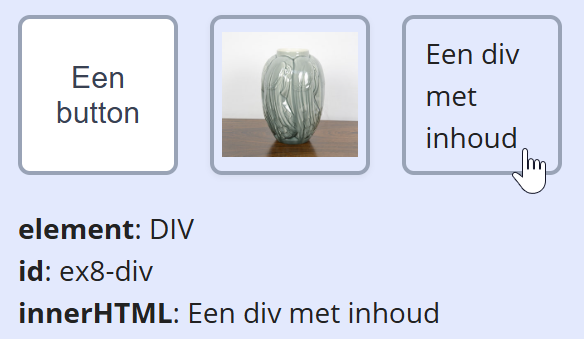

## Opdracht

In de HTML staan verschillende soorten elementen (button, afbeelding, div) in een container.

1. Declareer een constante met alle directe children van de container (tip: gebruik de `'.items > *'` selector).
2. Schrijf een event handler functie die de details van het geklikte element toont: het elementtype (`nodeName`), het `id` en de `innerHTML`.
3. Koppel met een `forEach` deze handler aan het `click` event van elk element.

## Screenshot

