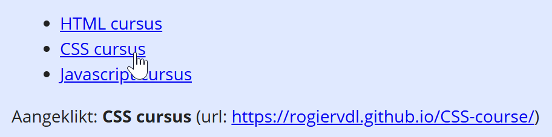

## Opdracht

Toon van de aangeklikte link de linktekst en de href:

- gebruik `querySelectorAll()` om alle links op te vragen
- overloop ze met `forEach()` en koppel aan elke link een `'click'` event
- gebruik `preventDefault()` om de standaardactie van de link uit te schakelen
- toon tenslotte de linktekst en de href van de aangeklikte link (gebruik `e.target`) in het uitvoergebied

## Screenshot

