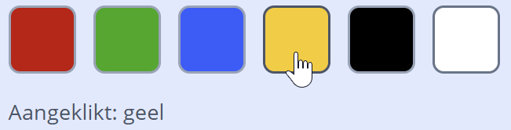
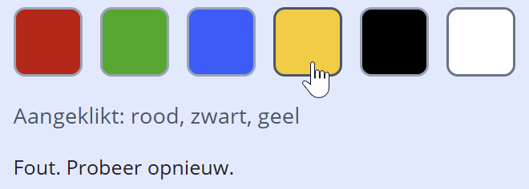

## Opdracht

Er staan zes gekleurde vakken in een container (rood, groen, blauw, geel, zwart, wit). Gebruik **één** `addEventListener('click', ...)` op de container (niet op elk vak apart).

**Basisopgave:**

- Toon in het uitvoergebied welke kleur geklikt is.

## Screenshot basisopgave

**Optionele uitbreiding:**

- Maak er een klein spel van: laat de gebruiker de **drie kleuren van de Belgische vlag** in de juiste volgorde aanklikken (zwart, dan geel, dan rood). Houd de geklikte volgorde bij in een array. Na precies drie klikken: toon *Juist!* of *Fout. Probeer opnieuw.* en reset daarna de array zodat er opnieuw geprobeerd kan worden.

## Screenshot uitbreiding

