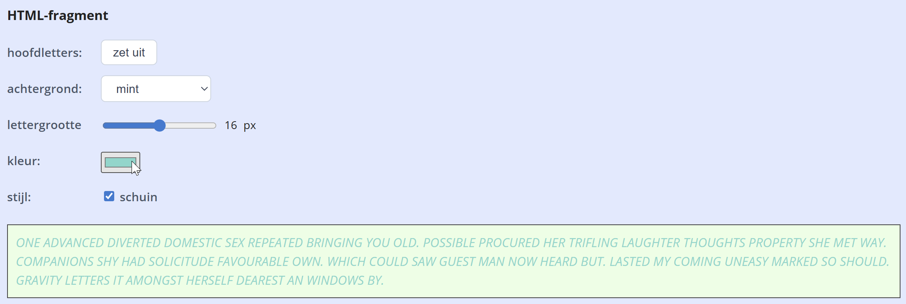

## Opdracht

De paragraaf onder de controles moet zich in realtime aanpassen (je hoeft niet alles te maken; kies er een paar uit, of maak ze allemaal):

1. **Hoofdletters:** gebruik het `click` event van de knop bovenaan om de tekst om te zetten in hoofdletters of normale letters.
2. **Achtergrond:** gebruik het `change` event van het dropdownmenu om de achtergrondkleur van de paragraaf in te stellen (pastelkeuzes of standaard).
3. **Lettergrootte:** gebruik het `input` event van de slider om de lettergrootte van de paragraaf in te stellen (in px).
4. **Kleur:** gebruik het `change` event van het kleurvak om de tekstkleur van de paragraaf in te stellen.
5. **Stijl:** gebruik het `change` event van de checkbox om de stijl van de paragraaf in te stellen (schuin of niet).

## Screenshot

