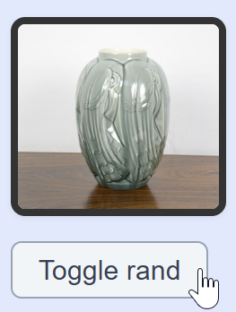
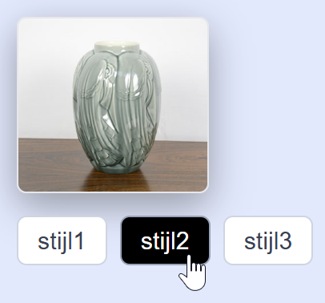

## Opdracht 1

Bij een klik op de knop moet de class `bordered` op de afbeelding aan- of uitgezet (*getoggeld*) worden. Gebruik `classList.toggle(...)`.

## Screenshot 1

## Opdracht 2

Er zijn vier stijlen gedefinieerd in CSS: `.stijl1`, `.stijl2`, `.stijl3` en `.stijl4`. Elke knop wijst een stijl toe. Er kan maar één stijl tegelijk zijn. Mogelijke strategie:

1. declareer constanten voor de afbeelding, en voor alle buttons (gebruik `querySelectorAll()`)
2. voeg dezelfde click event handler toe aan alle buttons met `forEach()`
3. in die handler:
   - verwijder `stijl1`, `stijl2`, `stijl3` en `stijl4` uit de `classList` van de afbeelding
   - wijs de juiste class weer toe afhankelijk van de geklikte button (gebruik `e.target.dataset.stijl`)
   - verwijder de `active` class van de vorige button, en voeg die toe aan de huidige button

*tip: de modeloplossing is 9 regels code.*

## Screenshot 2

