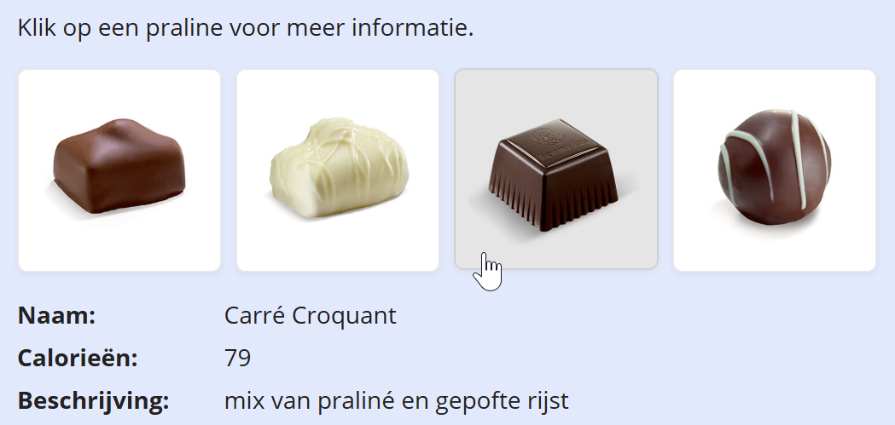

## Opdracht

Gegeven is een lijst pralines met custom attributen `data-name` en `data-cal` (inspecteer de HTML om ze te zien). Bij een klik op een praline:

1. Toon de naam en het aantal calorieën uit `dataset`; de beschrijving haal je uit de `alt` van de afbeelding. Toon alles in het definitielijstje onder de lijst.
2. Zorg dat de huidig aangeklikte praline de class `selected` krijgt (bijhorende CSS staat in *styles.css*).

## Screenshot

