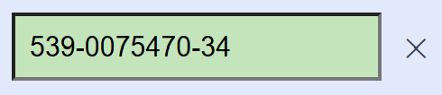

## Opdracht

We maken een input om een rekeningnummer van formaat **539-0075470-34** in te tikken:

- alleen cijfers mogen getypt worden, en er mogen niet meer dan 14 karakters zijn; de rest moet tegengehouden worden
- de streepjes moeten automatisch verschijnen na karakter 3 en 11
- als er 14 karakters zijn (rekeningnummer is volledig), moet het gevalideerd worden: indien juist, geef het een groene achtergrond, anders rood
- de wissenknop moet verborgen zijn, en verschijnen als het tekstvak niet leeg is

Stappenplan:

- Maak in *styles.css* drie klassen (of gebruik de klassen die er al in staan):
  - `.right` voor een groene achtergrond (`#b8e6b8`)
  - `.wrong` voor een rode achtergrond (`#f0b0b0`)
  - `.hidden` om te verbergen
- Koppel `keydown` aan het tekstveld: sta alleen cijfers toe (gebruik `/[0-9]/.test(...)`), en sta niet meer dan 14 karakters toe.
- Koppel `input` aan het tekstveld:
  - voeg een streepje toe als er 3 of 11 tekens zijn
  - toon de wissenknop enkel als het tekstveld niet leeg is
  - als er 14 tekens zijn: controleer of het geldig is, en wijs de `.right` of `.wrong` klasse toe
- Implementeer tenslotte de wissenknop

Gebruik deze functie voor het valideren van een rekeningnummer:

```js
function valideerNummer(nr) {
   nr = nr.replace(/\D/g, '');
   if (nr.length != 12) return false;
   const eerste10 = parseInt(nr.slice(0, 10), 10);
   const controle = parseInt(nr.slice(10, 12), 10);
   return eerste10 % 97 === controle;
}
```

## Screenshot


