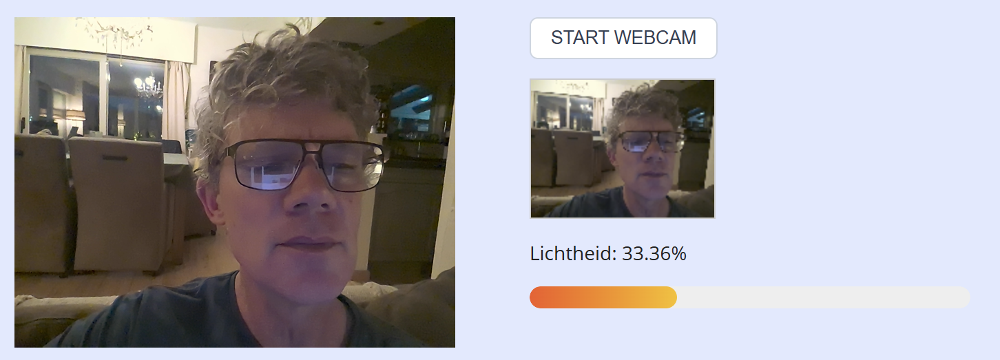

## Opdracht

We maken een applicatie waarbij je de webcam kan starten, een snapshot nemen en de lichtheid in % weergeven.

### Deel 1: periodiek nemen van een snapshot

1. Vertrek van de [Photobooth demo](https://rogiervdl.github.io/JS-course/04_games.html#voorbeeld-2-photobooth) uit de theorie. Pas de code zo aan dat er slechts één snapshot kan genomen worden, en verwijder het filtergedeelte.
2. Pas de code aan zodat de webcam niet automatisch gestart wordt, maar via de knop. De snapshot wordt automatisch elke seconde genomen met `setInterval()`. Schematisch:

```js
function takeSnapshot() {
   ...
}

async function handleBtnStartWebcamClick() {
   ...
   setInterval(takeSnapshot, 1000);
}

btnStartWebcam.addEventListener('click', handleBtnStartWebcamClick);
```

### Deel 2: tonen van de lichtheid

3. Breid `takeSnapshot()` uit zodat de progress bar en het percentage bijgewerkt worden. Gebruik deze functie om de lichtheid te berekenen:

```js
function getLightnessFromCanvas(cnv) {
   const context = cnv.getContext('2d');
   const imageData = context.getImageData(0, 0, cnv.width, cnv.height);
   const data = imageData.data;
   let sumLightness = 0;
   const pixelCount = data.length / 4;
   for (let i = 0; i < data.length; i += 4) {
      sumLightness += (data[i] + data[i + 1] + data[i + 2]) / 3;
   }
   return (sumLightness / pixelCount / 255 * 100).toFixed(2);
}
```

*tip: gebruik de lamp van je smartphone als lichtbron om te testen*

## Screenshot


