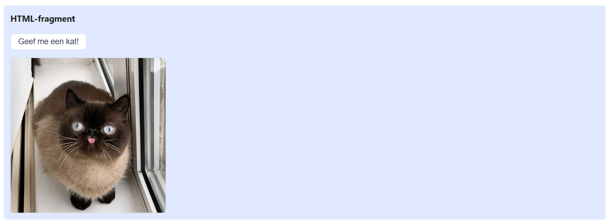
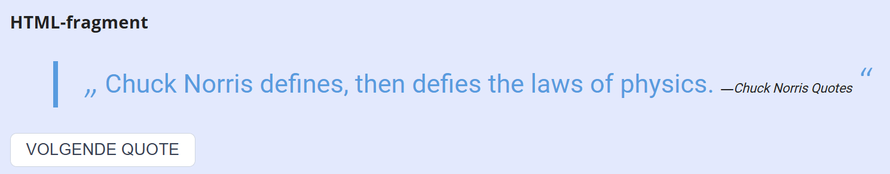
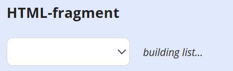
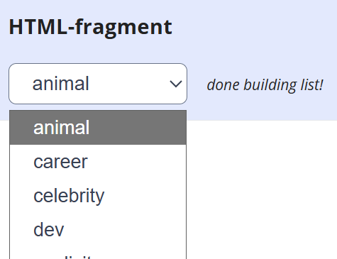

## Opdracht A – geef me een kat

We gebruiken de [Cat as a service (CATAAS) API](https://cataas.com/doc.html).

1. schrijf een asynchrone functie `fetchCatImage()` die de URL van een random afbeelding teruggeeft; gebruik dit eindpunt: `https://cataas.com/cat?json=true`
2. gebruik deze functie in de click event handler van de button om een random afbeelding op te vragen en de `src` van de afbeelding in te stellen

## Screenshot A

## Opdracht B – random quote

We gebruiken de [Chuck Norris API](https://api.chucknorris.io/).

1. schrijf een asynchrone functie `fetchRandomQuote()` die een random Chuck Norris quote teruggeeft
2. schrijf een tweede asynchrone functie `showRandomQuote()` die een quote opvraagt en instelt in de blockquote
3. roep `showRandomQuote()` op bij de start van de applicatie
4. koppel `showRandomQuote()` ook aan het `click` event van de "volgende quote" knop

## Screenshot B

## Opdracht C – categories list

We gaan verder met de [Chuck Norris API](https://api.chucknorris.io/).

1. schrijf een asynchrone functie `fetchQuoteCategories()` die alle categorieën opvraagt
2. schrijf een tweede asynchrone functie `initCategoriesDropdown()` die de dropdown vult met `option` elementen
3. roep `initCategoriesDropdown()` op bij de start van de applicatie

## Screenshot C

