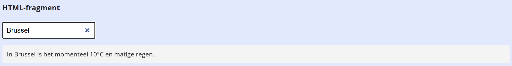

## Opdracht: OpenWeatherMap

We gebruiken [https://openweathermap.org/api](https://openweathermap.org/api).

1. Vraag eerst een API key aan op [https://openweathermap.org/api](https://openweathermap.org/api).
2. Schrijf een methode `getWeatherInfo(city)` die weerinfo geeft op basis van een stad. Basis URL: `https://api.openweathermap.org/data/2.5/weather`. Geef volgende parameters mee:
   - **q**: naam van de stad
   - **units**: `'metric'`
   - **lang**: `'nl'`
   - **appid**: jouw API key

   Doe een fetch met de parameters en return een tekstuele samenvatting van de weerinfo.
3. Schrijf een event handler op het `change` event van de input om de weerinfo te tonen.

## Screenshot

