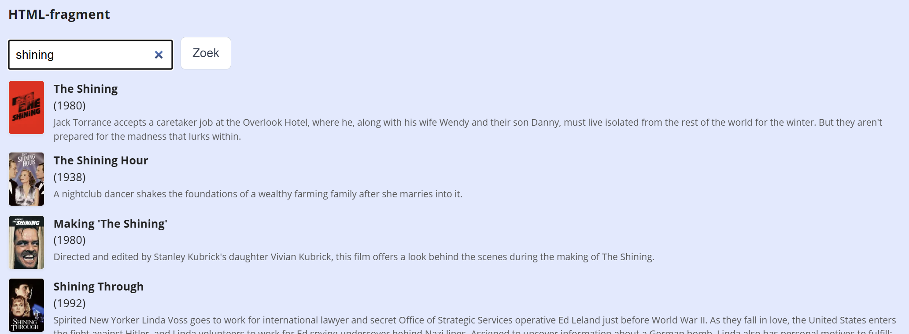

## Opdracht: The Movie Database

We gebruiken de [The Movie Database (TMDB) API](https://www.themoviedb.org/).

1. Maak een gratis account aan op [https://www.themoviedb.org/](https://www.themoviedb.org/) en ga naar *Instellingen → API*. Kopieer de **API Read Access Token** (de lange JWT-string onderaan, niet de korte API key).
2. Schrijf een asynchrone functie `searchMovies(term)` die films zoekt op basis van een zoekterm:
   - gebruik endpoint `https://api.themoviedb.org/3/search/movie`
   - geef de `term` mee als query parameter **query**
   - geef de token mee als Bearer token in de **Authorization** header
   - return `data.results`
3. Schrijf een event handler op de knop die de resultaten toont als een lijst van films (poster, titel, jaar en beschrijving). Posterpaden zijn relatief: gebruik `https://image.tmdb.org/t/p/w92` als basisURL voor de poster.

## Screenshot

