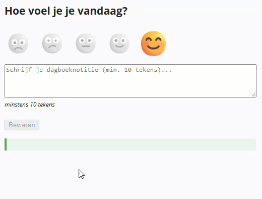

## Doel

Dit is een oefening op events, validatie, DOM HTML manipulatie, target/this... zie [https://rogiervdl.github.io/JS-course/02_domhtml.html](https://rogiervdl.github.io/JS-course/02_domhtml.html).

## Opgave

We bouwen een **stemmingstracker**: je kiest je dagelijkse stemming via een emoji en schrijft een korte notitie; bij bewaren verschijnt een samenvatting.

## Taken

1. Declareer een constante voor de minimale notitielengte (10) en een array met labels 'Rottig', 'Meh', 'Ok', 'Chill', en 'Toppie'
2. Declareer een variabele `stemmingNummer` voor het nummer van de geselecteerde stemming (begin met 4: de laatste emoji staat al actief in de HTML)
3. Declareer constanten voor alle nodige DOM-elementen:
   - alle stemmingen
   - de bewaarknop
   - het tekstvak
   - de div met de uitvoer
4. Koppel de handlers aan alle events onderaan:
   - klik-event op alle stemmingen (gebruik `forEach`)
   - event dat een wijziging in het tekstvak detecteert
   - klik-event op de knop
5. Definieer tenslotte de drie event handlers zelf:
   - stemmingen klik handler:
      - haal het nummer van de stemming (0-4) uit de id van de geklikte stemming met `parseInt(id.split('-')[1])`
      - sla die op in de variabele `stemmingNummer`
      - activeer de stemming: verwijder de class `actief` van alle stemmingen, en voeg ze toe aan de **geklikte** stemming
   - tekstvak handler:
      - stel de waarde van `disabled` van de knop in naargelang het aantal karakters in het tekstvak
   - knop klik handler:
      - toon de uitvoer naar voorbeeld van de screenshot (gebruik twee keer `
` en `<strong>`)

## Tips

Probeer zoveel mogelijk uit te voeren, ook als bepaalde onderdelen niet lukken. Zorg dat je declaraties correct zijn. Koppel alvast de functies aan events, maar laat de body nog leeg. Zet stukken code die niet werken in commentaar. Zorg ervoor dat je code de juiste opbouw heeft en voorzie het van commentaar.

## Screenshot

