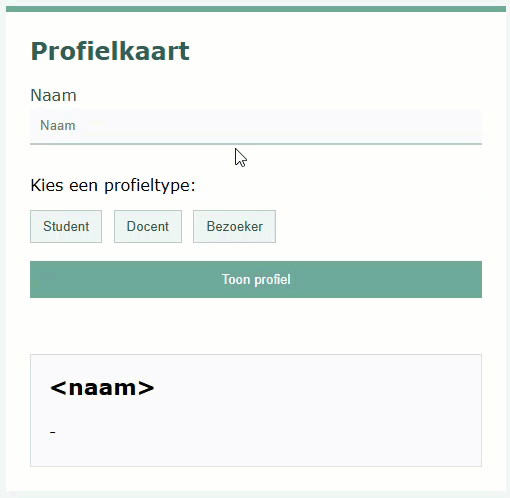

## Doel

Dit is een oefening op events, validatie, DOM HTML manipulatie, target/this... zie [https://rogiervdl.github.io/JS-course/02_domhtml.html](https://rogiervdl.github.io/JS-course/02_domhtml.html).

## Opgave

Bouw een eenvoudige **profielkaart**. De gebruiker vult een naam in, kiest een profieltype en klikt op *Toon profiel*. De kaart onderaan wordt dan ingevuld; bij een volgende klik wordt de vorige inhoud overschreven.

## Taken

De profielkaart staat al klaar in de HTML met `<naam>` als plaatshouder: je vult ze in, je genereert ze niet.

1. Declareer een constante `STATUSSEN` met de statuszin per profieltype. Het laatste woord staat cursief, dus de zin bevat HTML:
   - Student: `Welkom op het <em>studentenplatform</em>.`
   - Docent: `Welkom in de <em>docentenomgeving</em>.`
   - Bezoeker: `Welkom als <em>bezoeker</em>.`
2. Declareer een variabele `gekozenType` met een lege string als beginwaarde
3. Declareer constanten voor het tekstvak, alle profieltypeknoppen, de knop *Toon profiel*, de paragraaf met de foutmelding en de profielkaart
4. Declareer constanten voor de naam, het profieltype en de statuszin **binnen** de kaart. Gebruik daarvoor de kaart in plaats van `document.` als context voor de query selector.
5. Koppel met `forEach()` een klik-event aan elke profieltypeknop, en één aan de knop *Toon profiel*
6. In de handler van de profieltypeknoppen:
   - haal het profieltype uit de tekst van de aangeklikte knop en bewaar het in `gekozenType`
   - verplaats de class `actief` naar de aangeklikte knop
7. In de handler van *Toon profiel*:
   - wis de foutmelding
   - is er geen profieltype gekozen: toon "Kies een profieltype." en stop
   - vul naam, profieltype en statuszin in op de kaart
   - geef de kaart de class van het gekozen type (`student`, `docent` of `bezoeker`) en verwijder de vorige
   - maak het tekstvak leeg

## Tips

Probeer zoveel mogelijk uit te voeren, ook als bepaalde onderdelen niet lukken. Zorg dat je declaraties correct zijn. Koppel alvast de functies aan events, maar laat de body nog leeg. Zet stukken code die niet werken in commentaar. Zorg ervoor dat je code de juiste opbouw heeft en voorzie het van commentaar.

## Screenshot

