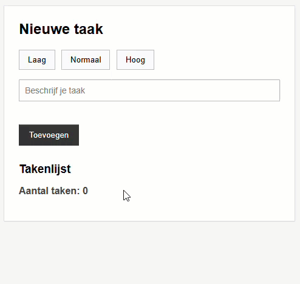

## Doel

Dit is een oefening op events, validatie, DOM HTML manipulatie, target/this... zie [https://rogiervdl.github.io/JS-course/02_domhtml.html](https://rogiervdl.github.io/JS-course/02_domhtml.html).

## Opgave

We bouwen een **takenplanner**: je kan een prioriteit selecteren en een taak ingeven. Bij klikken op *Toevoegen* verschijnt de taak onderaan. Eerder toegevoegde taken blijven staan.

## Taken

1. Declareer een variabele `gekozenPrioriteit` met een lege string als beginwaarde
2. Declareer een variabele `aantalTaken` met 0 als beginwaarde
3. Declareer constanten voor alle nodige DOM-elementen:
   - alle prioriteitsknoppen
   - het tekstvak voor de taak
   - de paragraaf met de foutmelding
   - de toevoegknop
   - de paragraaf met het aantal taken
   - de div met de uitvoer
4. Koppel aan alle prioriteitsknoppen een klik-event:
   - haal de prioriteit uit de tekst van de aangeklikte knop
   - bewaar die waarde in de variabele `gekozenPrioriteit`
   - voeg de class `actief` toe aan de aangeklikte knop, en verwijder ze bij de andere knoppen
5. Bij klik op *Toevoegen*:
   - wis eerst de melding onder het tekstvak
   - als er geen prioriteit gekozen is: toon "Kies een prioriteit." en stop
   - anders:
      - verhoog `aantalTaken` met 1 en pas de tekst bij *Aantal taken* aan
      - voeg de nieuwe taak toe aan de uitvoer-`div`, zodat eerder toegevoegde taken blijven staan
      - maak het tekstvak opnieuw leeg

## Tips

Probeer zoveel mogelijk uit te voeren, ook als bepaalde onderdelen niet lukken. Zorg dat je declaraties correct zijn. Koppel alvast de functies aan events, maar laat de body nog leeg. Zet stukken code die niet werken in commentaar. Zorg ervoor dat je code de juiste opbouw heeft en voorzie het van commentaar.

## Screenshot

