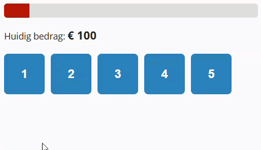

## Doel

Dit is een oefening op DOM CSS manipulatie: de style property, classList, data-attributen... zie [https://rogiervdl.github.io/JS-course/03_domcss.html](https://rogiervdl.github.io/JS-course/03_domcss.html).

## Opgave

Bouw een spel waarmee je je inzet kan verhogen, verlagen of zelfs helemaal kwijtraken.

- het oorspronkelijke bedrag is 100
- er zitten vijf opties verborgen achter de knoppen: maal 3, maal 0, maal 4, maal 0.5 en maal 2
- de gebruiker klikt knoppen tot het bedrag ≥ 1000 is (gewonnen), of 0 is (verloren)
- een schuifbalk geeft de status weer (van smal/rood naar breed/groen)

## Taken

De functie `berekenRgbKleur()` is al gegeven: die zet een bedrag tussen 0 en 1000 om naar een RGB-waarde tussen rood en groen.

1. Declareer constanten `STARTBEDRAG` (100) en `DOELBEDRAG` (1000)
2. Declareer een variabele voor het huidige bedrag; initialiseer op `STARTBEDRAG`
3. Declareer constanten voor alle nodige DOM-elementen:
   - alle knoppen
   - de paragraaf voor de melding
   - de span voor het bedrag
   - de div voor de balk
4. Koppel met `forEach()` een klik-event aan elke knop
5. In de klik-event handler:
   - zet de aangeklikte knop in een constante `knop`
   - toon de inhoud van de `div` onder de knop:
      - zoek de `id` van dit element op via het `data-target` attribuut van de knop
      - zoek het element op via deze `id`
      - toon het door de CSS class `open` toe te voegen aan dit element
   - zet `disabled` van de knop op `true`
   - lees de factor uit via het `data-factor` attribuut van de knop, vermenigvuldig het bedrag ermee en rond het resultaat af
   - werk de voortgangsbalk bij: stel de `width` en de `background-color` in op basis van het bedrag
      - de breedte in procent is het bedrag gedeeld door het doelbedrag, maal honderd; rond af op een geheel getal
      - begrens die breedte op 100, anders loopt de balk buiten de kaart zodra je wint
      - de kleur krijg je van `berekenRgbKleur()`
   - toon het nieuwe bedrag
   - controleer op gewonnen of verloren:
      - toon "Gewonnen!" of "Verloren!" in de melding
      - schakel alle knoppen uit

## Tips

Probeer zoveel mogelijk uit te voeren, ook als bepaalde onderdelen niet lukken. Zorg dat je declaraties correct zijn. Koppel alvast de functies aan events, maar laat de body nog leeg. Zet stukken code die niet werken in commentaar. Zorg ervoor dat je code de juiste opbouw heeft en voorzie het van commentaar.

## Screenshot

