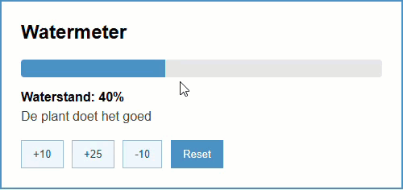

## Doel

Dit is een oefening op DOM CSS manipulatie: de style property, classList, data-attributen... zie [https://rogiervdl.github.io/JS-course/03_domcss.html](https://rogiervdl.github.io/JS-course/03_domcss.html).

## Opgave

Bouw een watermeter voor een plant. De gebruiker kan de plant water geven of laten uitdrogen met knoppen.
De waterstand wordt getoond met een voortgangsbalk. Afhankelijk van de waterstand verandert de tekst, de kleur van de balk en de stijl van de volledige kaart.

- De oorspronkelijke waterstand is 40, het minimum is 0 en het maximum 100.
- Er zijn vier knoppen: +10, +25, -10 en Reset.
- De waterbalk wordt breder of smaller afhankelijk van de waterstand.
- De tekst onder de balk toont de huidige waterstand.
- Onder die tekst verschijnt een melding afhankelijk van de waterstand
- De aangeklikte knop blijft aangeduid.
- De volledige kaart verandert van uitzicht afhankelijk van de waterstand: te droog, goed of te nat.

## Taken

1. Declareer constanten voor de maximumwaterstand en de startwaterstand
2. Declareer een variabele `huidigeWaterstand`.
3. Declareer constanten voor alle nodige DOM-elementen:
   - de volledige plant-app
   - alle knoppen
   - de paragraaf met de waterstand;
   - de paragraaf met de melding;
   - de div van de waterbalk.
4. Koppel met `forEach()` een klik-event aan elke knop
5. In de klik-event handler:
   - haal de aangeklikte knop op
   - haal daaruit de waarde via het `data-waarde` attribuut
   - is die waarde `reset`, zet `huidigeWaterstand` dan terug op de startwaterstand
   - tel ze anders op bij `huidigeWaterstand`
   - zorg dat `huidigeWaterstand` nooit lager dan 0 wordt
   - zorg dat `huidigeWaterstand` nooit hoger dan 100 wordt
   - verwijder de class actief van alle knoppen
   - voeg de class actief toe aan de aangeklikte knop
   - werk het scherm opnieuw bij met `werkSchermBij()` (zie hieronder)
6. Maak een functie `werkSchermBij()` die het scherm bijwerkt met de huidige stand (in `huidigeWaterstand`):
   - pas de tekst van de waterstand aan
   - stel de %-breedte van de waterbalk in
   - verwijder de classes `droog`, `goed` en `te-nat` van de plant-app
   - stel de balkkleur, de melding en de class in volgens de waterstand:
      - minder dan 30: oranje `#c98a3a`, "De plant heeft dorst", class `droog`
      - tussen 30 en 70: blauw `#4a90c2`, "De plant doet het goed", class `goed`
      - meer dan 70: groen `#2f7d4f`, "Niet te veel water geven", class `te-nat`

## Tips

Probeer zoveel mogelijk uit te voeren, ook als bepaalde onderdelen niet lukken. Zorg dat je declaraties correct zijn. Koppel alvast de functies aan events, maar laat de body nog leeg. Zet stukken code die niet werken in commentaar. Zorg ervoor dat je code de juiste opbouw heeft en voorzie het van commentaar.

## Screenshot

