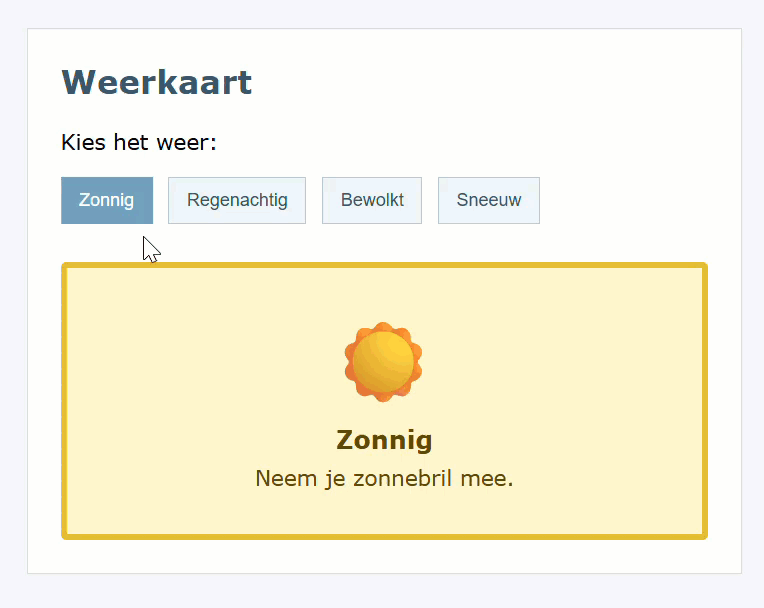

## Doel

Dit is een oefening op DOM CSS manipulatie: de style property, classList, data-attributen... zie [https://rogiervdl.github.io/JS-course/03_domcss.html](https://rogiervdl.github.io/JS-course/03_domcss.html).

## Opgave

Bouw een interactieve weerkaart. De gebruiker kan een weertype kiezen door op een knop te klikken. De weerkaart past zich daarna aan op basis van de gekozen knop.

Er zijn vier weerknoppen:
- Zonnig
- Regenachtig
- Bewolkt
- Sneeuw

Bij het openen van de pagina staat de weerkaart standaard op Zonnig.

Wanneer de gebruiker op een weerknop klikt:
- wordt de aangeklikte knop aangeduid als de huidige keuze
- blijft zichtbaar welke knoppen al eens gekozen zijn
- verandert het icoon, de titel en de tekst in de weerkaart
- krijgt de weerkaart de kleuren en de randdikte van het gekozen weertype
- verandert de grootte van het icoon

## Taken

Het icoon en de tekst staan in de `data-*` attributen van de knoppen. De titel neem je gewoon over uit de tekst op de knop.

Voor de opmaak van de kaart bestaan al vier CSS-classes: `zonnig`, `regenachtig`, `bewolkt` en `sneeuw`. Welke class bij welke knop hoort, staat in het attribuut `data-kaartstijl`.

1. Declareer constanten voor alle nodige DOM-elementen:
   - alle weerknoppen
   - de weerkaart
   - het icoon in de weerkaart
   - de titel in de weerkaart
   - de tekst in de weerkaart
2. Koppel met `forEach()` een klik-event aan elke weerknop
3. In de event handler:
   - haal de aangeklikte knop op
   - pas de knoppen aan:
      - verwijder de class `current` van alle weerknoppen
      - voeg de class `current` toe aan de aangeklikte knop
      - voeg de class `visited` toe aan de aangeklikte knop
   - lees het weertype uit de tekst op de knop, en het icoon, de tekst, de icoongrootte en de kaartstijl uit de data-attributen
   - pas de inhoud van de weerkaart aan: het icoon, de titel en de tekst
   - geef de weerkaart de juiste class:
      - verwijder eerst de kaartstijl van élke weerknop, zodat het ook blijft werken als er later een weertype bijkomt
      - voeg daarna de kaartstijl van de aangeklikte knop toe
   - pas de grootte van het icoon aan; let op dat een maat een eenheid nodig heeft

## Tips

Probeer zoveel mogelijk uit te voeren, ook als bepaalde onderdelen niet lukken. Zorg dat je declaraties correct zijn. Koppel alvast de functies aan events, maar laat de body nog leeg. Zet stukken code die niet werken in commentaar. Zorg ervoor dat je code de juiste opbouw heeft en voorzie het van commentaar.

## Screenshot

