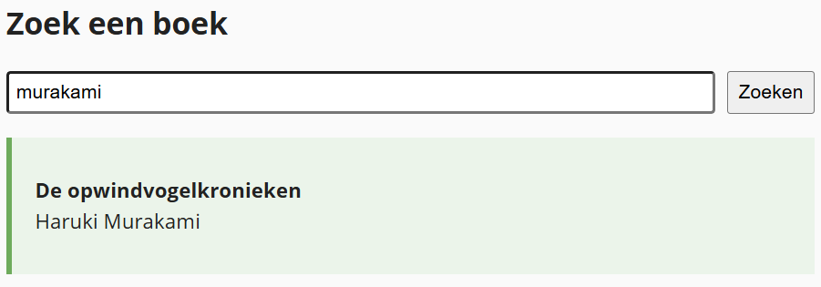

## Doel

Dit is een oefening op fetch, async/await en web-API's... zie [https://rogiervdl.github.io/JS-course/05_async.html](https://rogiervdl.github.io/JS-course/05_async.html).

## Opgave

Bouw een **boekzoeker**. De gebruiker typt een zoekterm en klikt op *Zoeken*. Het eerste resultaat verschijnt onderaan met titel en auteur; wordt er niets gevonden, dan verschijnt de melding "Boek niet gevonden.".

De API-url, de documentatie en de API key vind je op [https://rvdl.be/bibliotheekAPI/](https://rvdl.be/bibliotheekAPI/). De key moet als header bij elk verzoek mee.

## Taken

1. Declareer constanten voor de API-url en de API key
2. Declareer constanten voor het invoerveld, de zoekknop, de paragraaf voor de melding en de div voor de uitvoer
3. Schrijf een asynchrone functie `fetchEersteBoek(zoekterm)` die:
   - de URL samenstelt met parameters `search` en `type`
   - de gegevens ophaalt bij de API, met de key in de header
   - het eerste boek teruggeeft, of `null` als er niets gevonden is
4. Koppel een klik-event aan de zoekknop
5. In de event handler:
   - wis de vorige melding en uitvoer
   - roep `fetchEersteBoek()` aan en wacht het resultaat af
   - is er niets gevonden: toon "Boek niet gevonden." en stop
   - toon anders de titel en de auteur in de uitvoer

## Tips

Probeer zoveel mogelijk uit te voeren, ook als bepaalde onderdelen niet lukken. Zorg dat je declaraties correct zijn. Koppel alvast de functies aan events, maar laat de body nog leeg. Zet stukken code die niet werken in commentaar. Zorg ervoor dat je code de juiste opbouw heeft en voorzie het van commentaar.

## Screenshot

