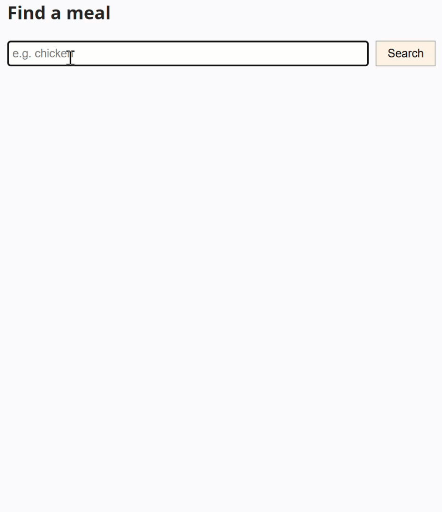

## Doel

Dit is een oefening op fetch, async/await en web-API's... zie [https://rogiervdl.github.io/JS-course/05_async.html](https://rogiervdl.github.io/JS-course/05_async.html).

## Opgave

Bouw een **gerechtzoeker**. De gebruiker typt een zoekterm en klikt op *Search*. De eerste vijf gevonden gerechten verschijnen onderaan, elk met foto, naam, categorie en keuken.

- een zoekterm kan tientallen resultaten opleveren; toon er hoogstens vijf
- tijdens het ophalen verschijnt de melding "Loading meals..."
- wordt er niets gevonden, dan verschijnt "No meals found." en blijft de lijst leeg

De API-url, de documentatie en de API key vind je op [https://rvdl.be/mealAPI/](https://rvdl.be/mealAPI/). De key moet als header bij elk verzoek mee.

## Taken

1. Declareer constanten voor de API-url, de API key en het maximum aantal resultaten (5)
2. Declareer constanten voor het invoerveld, de zoekknop, de paragraaf voor de melding en de div voor de uitvoer
3. Schrijf een asynchrone functie `fetchGerechten(zoekterm)` die:
   - de URL samenstelt met parameter `s`
   - de gegevens ophaalt bij `/search.php`, met de key in de header
   - de lijst gerechten teruggeeft, of een lege array als er niets gevonden is
4. Koppel een klik-event aan de zoekknop
5. In de event handler:
   - toon de melding "Loading meals..." en wis de vorige lijst
   - roep `fetchGerechten()` aan en wacht het resultaat af
   - is de lijst leeg: toon "No meals found." en stop
   - wis anders de melding en houd hoogstens de eerste vijf gerechten over
6. Toon elk overgehouden gerecht in de uitvoer. Gebruik daarvoor de voorbeeld HTML in commentaar in het HTML startbestand.

## Tips

Let op: deze API geeft bij een mislukte zoekopdracht geen lege lijst terug, maar `null`. Bekijk het antwoord eerst in de console of in Postman voor je het verwerkt.

Probeer zoveel mogelijk uit te voeren, ook als bepaalde onderdelen niet lukken. Zorg dat je declaraties correct zijn. Koppel alvast de functies aan events, maar laat de body nog leeg. Zet stukken code die niet werken in commentaar. Zorg ervoor dat je code de juiste opbouw heeft en voorzie het van commentaar.

## Screenshot

