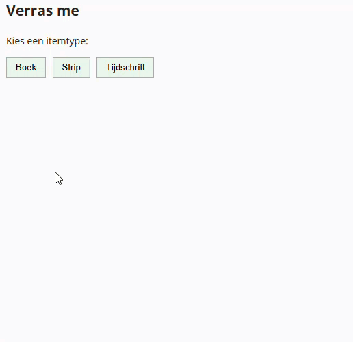

## Doel

Dit is een oefening op fetch, async/await en web-API's... zie [https://rogiervdl.github.io/JS-course/05_async.html](https://rogiervdl.github.io/JS-course/05_async.html).

## Opgave

Bouw een **verrassingsknop** voor de bibliotheek. De gebruiker kiest een itemtype — boek, strip of tijdschrift — en krijgt daarvan een willekeurig item te zien, met cover, titel, auteur en beschrijving.

- tijdens het ophalen verschijnt de melding "Item wordt opgehaald..."
- levert de API niets op, dan verschijnt "Geen item gevonden." en blijft de kaart verborgen

De API-url, de documentatie en de API key vind je op [https://rvdl.be/bibliotheekAPI/](https://rvdl.be/bibliotheekAPI/). De key moet als header bij elk verzoek mee.

## Taken

De kaart staat al klaar in de HTML met plaatshouders: je vult ze in, je genereert ze niet. Ze is verborgen zolang ze de class `verborgen` heeft.

1. Declareer constanten voor de API-url en de API key
2. Declareer constanten voor de typeknoppen, de paragraaf voor de melding en de kaart
3. Declareer constanten voor de cover, de titel, de auteur en de beschrijving **binnen** de kaart. Gebruik daarvoor de kaart in plaats van `document.` als context voor de query selector
4. Schrijf een asynchrone functie `fetchRandomItem(type)` die:
   - de URL samenstelt met parameters `random` en `type`
   - de gegevens ophaalt bij `/items`, met de key in de header
   - het eerste item teruggeeft, of `null` als er niets gevonden is
5. Koppel een klik-event aan elke typeknop
6. In de event handler:
   - lees het gekozen itemtype uit het data-attribuut van de aangeklikte knop
   - toon de melding "Item wordt opgehaald..." en verberg de kaart
   - roep `fetchRandomItem()` aan en wacht het resultaat af
   - is er niets gevonden: toon "Geen item gevonden." en stop
   - vul anders cover, titel, auteur en beschrijving in, wis de melding en toon de kaart

## Tips

Probeer zoveel mogelijk uit te voeren, ook als bepaalde onderdelen niet lukken. Zorg dat je declaraties correct zijn. Koppel alvast de functies aan events, maar laat de body nog leeg. Zet stukken code die niet werken in commentaar. Zorg ervoor dat je code de juiste opbouw heeft en voorzie het van commentaar.

## Screenshot

