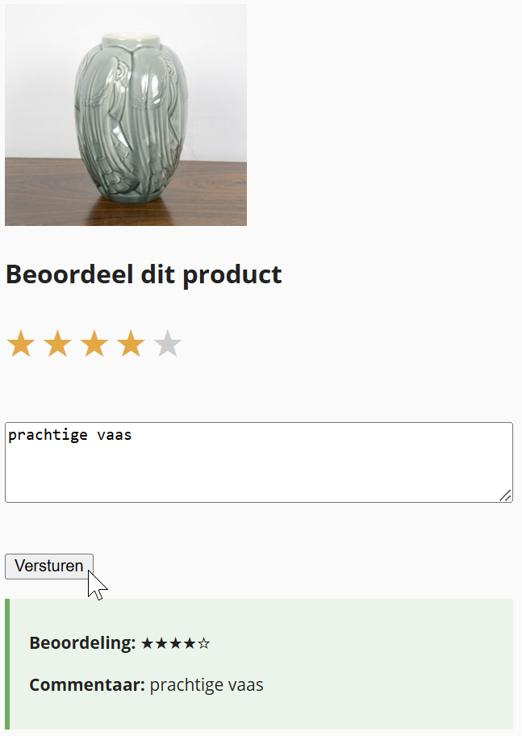

## Opdracht

Dit is een oefening op events, validatie, DOM HTML manipulatie, target/this... zie [https://rogiervdl.github.io/JS-course/02_domhtml.html](https://rogiervdl.github.io/JS-course/02_domhtml.html).

We bouwen een **productbeoordelaar**: je kan een aantal sterren selecteren en een bericht ingeven; bij verzenden verschijnt de beoordeling onderaan.

1. Declareeer constanten voor het aantal sterren (5) en een minimum berichtlengte (10)
2. Declareer een variabele `geselecteerdeSter` voor het nummer van de geselecteerde ster (0 = niet geselecteerd, 5 = laatste geselecteerd)
3. Declareer constanten voor alle nodige DOM-elementen: alle sterren, de verzendknop, het tekstvak, de paragraaf met de foutmelding, en de div met de uitvoer.
4. Koppel aan alle sterren een klik event: 
   - bewaar de waarde van de geselecteerde ster (1 tot 5)
      - de waarde kan je uit de id halen met `parseInt(id.split('-')[1]);`
      - sla die op in de variabele `geselecteerdeSter`
   - highlight de sterren: voeg de class `actief` toe aan elke ster tot en met de waarde, en verwijder het bij de rest
5. Bij klik op *Versturen*:
   - wis de melding onder de textarea
   - pas eenvoudige validatie toe:
      - als er geen ster geselecteerd is: toon `'Kies een beoordeling.'` in de melding
      - als het commentaar minder dan 10 tekens bevat: toon `'Schrijf minstens 10 tekens.'` in de melding
   - als alles geldig is: toon de samenvatting in de uitvoer `div`
      - maak bij voorkeur gebruik van een functie `maakSamenvattingHtml(waarde, commentaar)`
      - als het tekenen van de sterren te moeilijk is, vervang het dan door een tekst, b.v. `4 sterren`

## Tips

Probeer zoveel mogelijk uit te voeren, ook als bepaalde onderdelen niet lukken. Zorg dat je declaraties correct zijn. Koppel alvast de functies aan events, maar laat de body nog leeg. Zet stukken code die niet werken in commentaar. Zorg ervoor dat je code de juiste opbouw heeft en voorzie het van commentaar. 

## Screenshot

