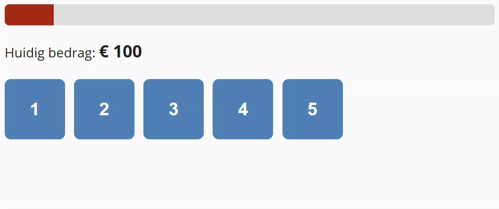

## Opdracht

Bouw een spel waarmee je je inzet kan verhogen, verlagen of zelfs helemaal kwijtraken:
- oorspronkelijk bedrag is 100
- er zitten vijf opties verborgen achter de knoppen: maal 3, maal 0, maal 4, maal 0.5 en maal 2
- de gebruiker klikt knoppen tot het bedrag ≥ 1000 is (gewonnen), of 0 is (verloren)
- een schuifbalk geeft de status weer (van smal/rood naar breed/groen)
- er is al een functie `berekenRgbKleur()` gegeven die een bedrag tussen 0 en 1000 omzet naar een RGB waarde tussen rood en groen

1. Declareer constanten voor startbedrag (100) en doelbedrag (1000) 
2. Declareer een variabele voor het huidige bedrag; initialiseer op startbedrag
3. Declareer constanten voor alle nodige DOM-elementen (knoppen, paragraaf voor melding, span voor het bedrag en div voor de balk)
4. Koppel met `forEach` een `click`-event aan elke knop
5. In de klik event handler:
   - zet de aangeklikte knop in een constante `knop`
   - toon de inhoud van de `div` onder de knop:
      - zoek de `id` van dit element op via het `data-target` attribuut van de knop 
      - zoek het element via deze `id` met `querySelector`
      - toon het door de CSS class `open` toe te voegen aan dit element
   - zet `disabled` van de knop op `true` 
   - lees de factor uit via het `data-target` attribuut van de knop, vermenigvuldig het bedrag ermee en rond het resultaat af
   - werk de voortgangsbalk bij: stel de `width` (0–100%) en `background-color` (waarde gegeven door `berekenRgbKleur()`) in op basis van het bedrag
   - toon het nieuwe bedrag 
   - controleer op gewonnen of verloren

## Screenshots

