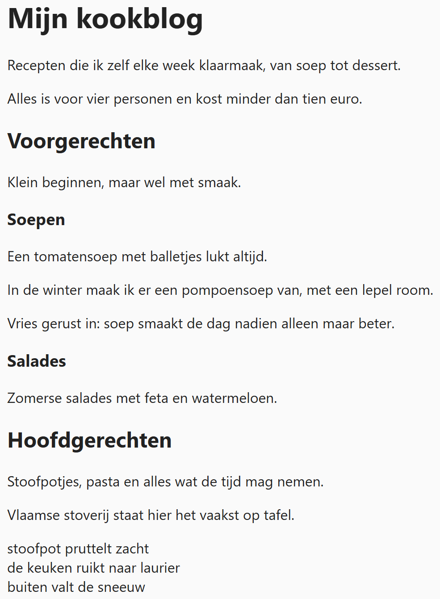

## Theorie

De uitgebreide uitleg vind je op [https://rogiervdl.github.io/HTML-course/02_tekst.html#blocklevel-elementen](https://rogiervdl.github.io/HTML-course/02_tekst.html#blocklevel-elementen)

### Paragrafen

Met `<p>` maak je een paragraaf. Het is één van de meest gebruikte elementen.

```html
<p>Dit is de eerste alinea.</p>
<p>Dit is de tweede alinea.</p>
```

Resultaat:


### Line breaks

Met  `<br>` forceer je een regeleinde. Dit wordt **zelden gebruikt**, enkel in bijvoorbeeld een adres of een gedicht:

```html
<p>
   Reisblog De Sporen<br><!-- geforceerde afbreking -->
   Stationsstraat 12<br>
   9000 Gent
</p>
```

Resultaat:


### Titels

Voor titels heeft HTML zes niveaus, van `<h1>` tot `<h6>`.  

- **h1** is de titel van de pagina; dit komt bijgevolg hooguit één keer per pagina voor
- **h2** zijn de hoofdstukken
- **h3*** de subhoofdstukken
- ... 

Let op: het nummer van de titel (1 tem 6) is NIET de grootte van de titel, maar de structurele betekenis! In sommige designs kan bijvoorbeeld een `<h1>` kleiner weergegeven worden dan een `<h2>`. 

Een voorbeeldfragment:

```html
<h1>Mijn kookblog</h1><!-- de titel van de pagina -->
<p>Recepten die ik zelf elke week klaarmaak, van soep tot dessert.</p>
<p>Alles is voor vier personen en kost minder dan tien euro.</p>

<h2>Voorgerechten</h2><!-- een hoofdstuk -->
<p>Klein beginnen, maar wel met smaak.</p>

<h3>Soepen</h3><!-- een subhoofdstuk van Voorgerechten -->
<p>Een tomatensoep met balletjes lukt altijd.</p>
<p>In de winter maak ik er een pompoensoep van, met een lepel room.</p>
<p>Vries gerust in: soep smaakt de dag nadien alleen maar beter.</p>

<h3>Salades</h3><!-- nog een subhoofdstuk -->
<p>Zomerse salades met feta en watermeloen.</p>

<h2>Hoofdgerechten</h2><!-- het volgende hoofdstuk -->
<p>Stoofpotjes, pasta en alles wat de tijd mag nemen.</p>
<p>Vlaamse stoverij staat hier het vaakst op tafel.</p>

<p>
   stoofpot pruttelt zacht<br><!-- een gedicht: de afbreking hoort bij de inhoud -->
   de keuken ruikt naar laurier<br>
   buiten valt de sneeuw
</p>
```

Resultaat:



## Opdracht

Maak onderstaande pagina naar voorbeeld van de screenshot.

1. de paginatitel, de landen en de steden krijgen elk het kopniveau dat bij hun plaats in de tekst hoort
2. elke alinea staat in een eigen paragraaf
3. het adres onderaan is één paragraaf met een regelafbreking na elke regel

### Screenshot


### Teksten

Alle teksten van de pagina staan hieronder, zonder opmaak, zodat je ze kan kopiëren.

```
Met de trein door Europa

Drie weken, vier landen en één treinpas. Hieronder een kort verslag van elke halte, met de dingen die ik zelf graag op voorhand had geweten.

Frankrijk

Parijs

De Thalys zet je in twee uur midden in de stad. Koop je metroticket meteen per tien: dat scheelt een pak aanschuiven.

Lyon

Veel rustiger dan Parijs, en het eten is er beter. De oude stad ligt op wandelafstand van het station.

Italië

Milaan

Eén dag volstaat: de kathedraal, een koffie aan de toog en verder met de trein.

Bologna

De verrassing van de reis. Kilometers overdekte galerijen, en studentenprijzen in de eetcafés rond de universiteit.

Contact

Reisblog De Sporen
Stationsstraat 12
9000 Gent
```
