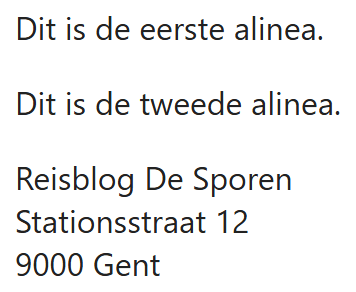
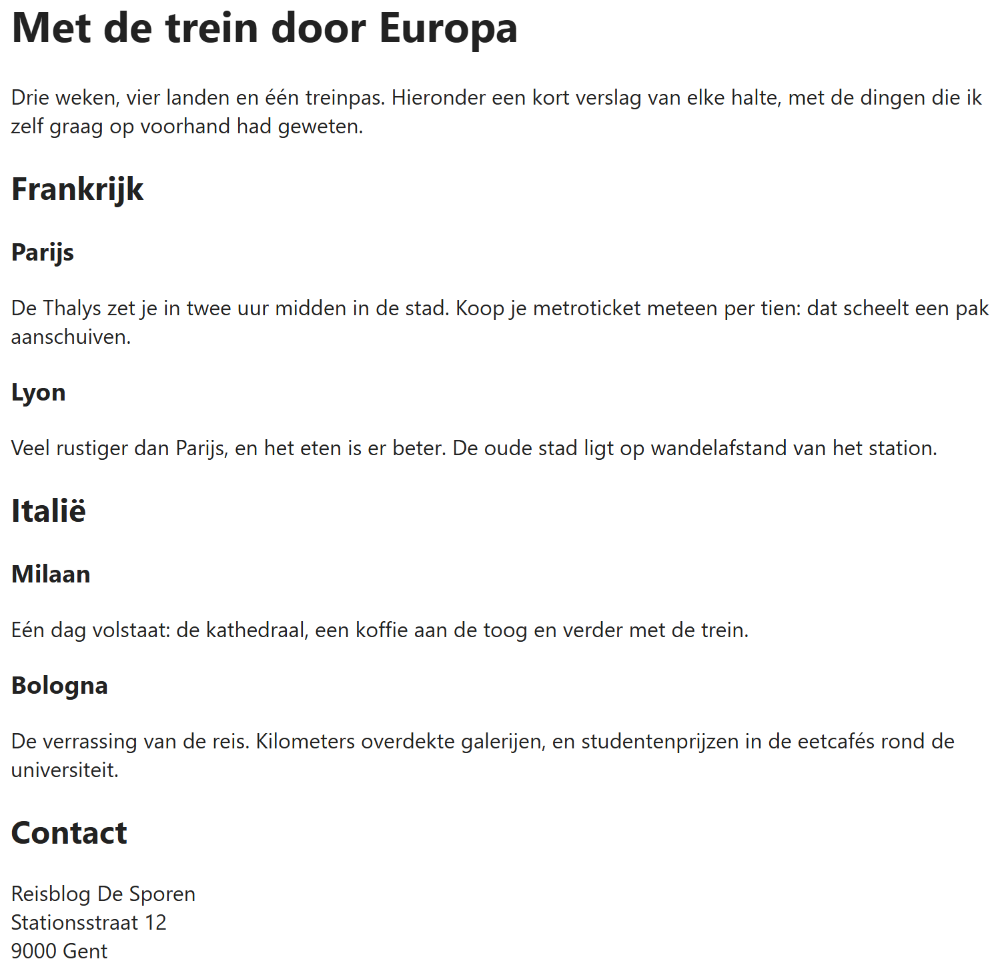

## Theorie

Een stuk lopende tekst zet je in een paragraaf met `<p>`. Elke alinea krijgt haar eigen `<p>`.

Voor een line break gebruik je `<br>`. Gebruik het **enkel** om een regeleinde te forceren zoals in een adres of een gedicht – nooit om paragrafen te maken.

```html
<p>Dit is de eerste alinea.</p>
<p>Dit is de tweede alinea.</p>

<p>
   Reisblog De Sporen<br><!-- geforceerde afbreking -->
   Stationsstraat 12<br>
   9000 Gent
</p>
```

Resultaat:



Voor titels heeft HTML zes kopniveaus, van `<h1>` tot `<h6>`. De vuistregel: **h1 is de titel van de pagina, h2 zijn de hoofdstukken, h3 de subhoofdstukken**, enzovoort. Daaruit volgt dat er **maar één `<h1>` per pagina** kan zijn: een pagina heeft nu eenmaal één titel. Sla ook geen niveaus over – na een `<h2>` komt een `<h3>`, niet meteen een `<h4>`.

Omgekeerd geldt hetzelfde: staat er op de pagina **geen zichtbare titel**, dan zet je er ook **geen `<h1>`**.

```html
<h1>Mijn kookblog</h1><!-- de titel van de pagina -->
<p>Recepten die ik zelf elke week klaarmaak, van soep tot dessert.</p>
<p>Alles is voor vier personen en kost minder dan tien euro.</p>

<h2>Voorgerechten</h2><!-- een hoofdstuk -->
<p>Klein beginnen, maar wel met smaak.</p>

<h3>Soepen</h3><!-- een subhoofdstuk van Voorgerechten -->
<p>Een tomatensoep met balletjes lukt altijd.</p>
<p>In de winter maak ik er een pompoensoep van, met een lepel room.</p>
<p>Vries gerust in: soep smaakt de dag nadien alleen maar beter.</p>

<h3>Salades</h3><!-- nog een subhoofdstuk -->
<p>Zomerse salades met feta en watermeloen.</p>

<h2>Hoofdgerechten</h2><!-- het volgende hoofdstuk -->
<p>Stoofpotjes, pasta en alles wat de tijd mag nemen.</p>
<p>Vlaamse stoverij staat hier het vaakst op tafel.</p>

<p>
   stoofpot pruttelt zacht<br><!-- een gedicht: de afbreking hoort bij de inhoud -->
   de keuken ruikt naar laurier<br>
   buiten valt de sneeuw
</p>
```

Resultaat:


## Opdracht

Maak onderstaande pagina naar voorbeeld van de screenshot.

1. de paginatitel, de landen en de steden krijgen elk het kopniveau dat bij hun plaats in de tekst hoort
2. elke alinea staat in een eigen paragraaf
3. het adres onderaan is één paragraaf met een regelafbreking na elke regel

## Screenshot


