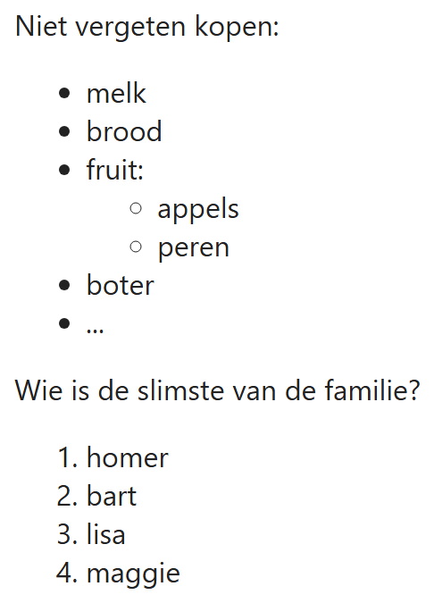
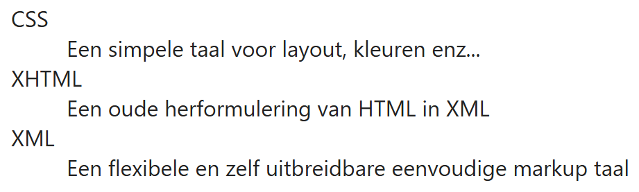
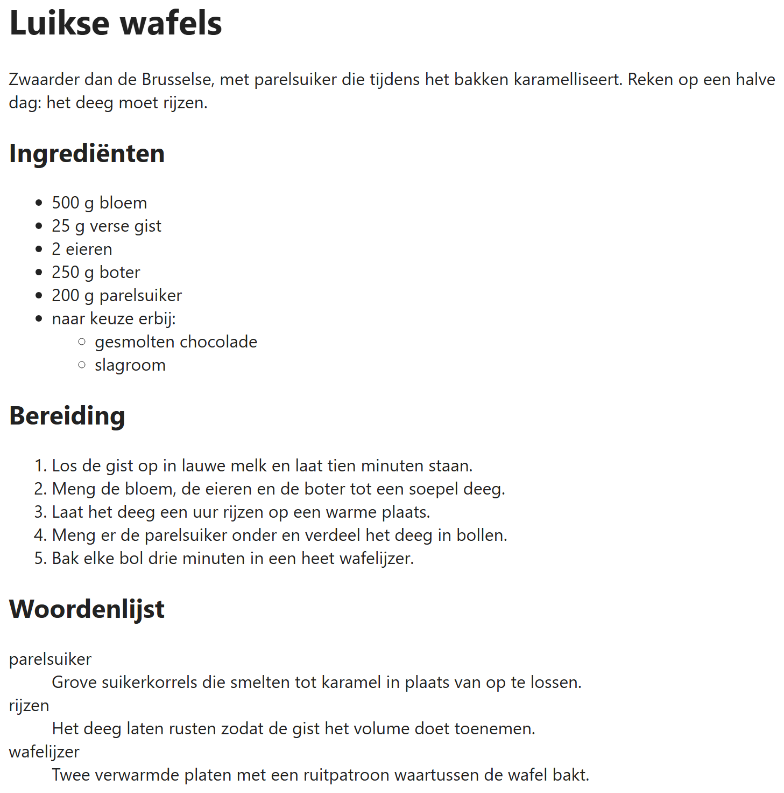

## Theorie

HTML kent drie soorten lijsten. Een **ongeordende** lijst `<ul>` gebruik je als de volgorde niet uitmaakt; de browser zet er bolletjes voor. Een **geordende** lijst `<ol>` gebruik je als de volgorde wél telt, zoals bij de stappen van een recept; die wordt genummerd. In beide gevallen is elk item een `<li>`. Kies op *betekenis*, niet op uitzicht: bolletjes en cijfers verander je later met CSS.

Een lijstitem mag zelf een lijst bevatten. Die binnenlijst zet je **binnen** de `<li>`, niet ertussen.

```html
<p>Niet vergeten kopen:</p>
<ul><!-- zonder nummering -->
   <li>melk</li>
   <li>brood</li>
   <li>fruit:
      <ul><!-- een geneste lijst -->
         <li>appels</li>
         <li>peren</li>
      </ul>
   </li>
   <li>boter</li>
   <li>...</li>
</ul>

<p>Wie is de slimste van de familie?</p>
<ol><!-- met nummering -->
   <li>homer</li>
   <li>bart</li>
   <li>lisa</li>
   <li>maggie</li>
</ol>
```

Resultaat:



De derde soort is de **definitielijst** `<dl>`: die koppelt telkens een term `<dt>` aan een beschrijving `<dd>`. Gebruik ze voor een woordenlijst, een reeks begrippen of veelgestelde vragen.

```html
<dl>
   <dt>CSS</dt><!-- de term -->
   <dd>Een simpele taal voor layout, kleuren enz...</dd><!-- de beschrijving -->
   <dt>XHTML</dt>
   <dd>Een oude herformulering van HTML in XML</dd>
   <dt>XML</dt>
   <dd>Een flexibele en zelf uitbreidbare eenvoudige markup taal</dd>
</dl>
```

Resultaat:



## Opdracht

Maak onderstaande pagina naar voorbeeld van de screenshot.

## Screenshot


