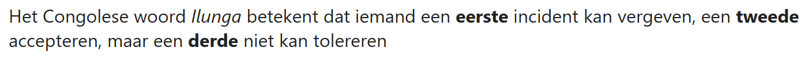
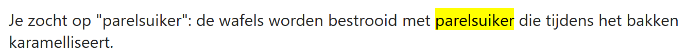
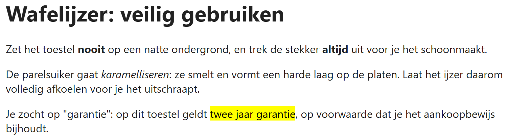

## Theorie

- `<strong>`: voor een stuk tekst die je **luider** zou uitspreken: iets belangrijks.
- `<em>`: voor een stuk tekst die je *trager* zou uitspreken, zoals een nieuwe term die je invoert.

Gebruik deze elementen hooguit op **één of enkele woorden**, nooit op een hele zin!

```html
<p>
   Het Congolese woord <em>Ilunga</em> betekent dat iemand<!-- een nieuwe term -->
   een <strong>eerste</strong> incident kan vergeven,<!-- belangrijk -->
   een <strong>tweede</strong> accepteren, maar
   een <strong>derde</strong> niet kan tolereren
</p>
```

Resultaat:



- `<mark>`: een stuk tekst die je wil markeren om een **externe reden**, bijvoorbeeld omdat het de zoekterm is die de bezoeker intikte.

De browser toont het standaard met een gele achtergrond. Ook hier geldt: gebruik het om die betekenis, niet omdat je iets geel wil.

```html
<p>
   Je zocht op "parelsuiker": de wafels worden bestrooid met
   <mark>parelsuiker</mark> die tijdens het bakken karamelliseert.<!-- de gevonden zoekterm -->
</p>
```

Resultaat:



## Opdracht

In de tekst hieronder staat nog geen enkele nadruk. Voeg ze toe naar voorbeeld van de screenshot.

1. de twee waarschuwingswoorden zijn belangrijk
2. karamelliseren is een nieuwe term die uitgelegd wordt
3. de bezoeker zocht op "twee jaar garantie": markeer wat hij gevonden heeft

## Screenshot


