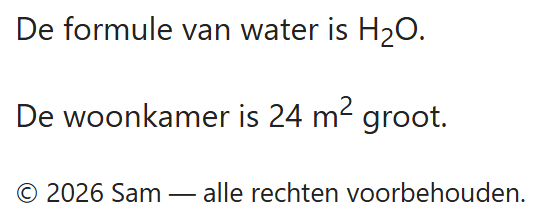

## Theorie

- `<sub>` – tekst lager plaatsen, b.v. H<sub>2</sub>O
- `<sup>` – tekst hoger plaatsen, b.v. m<sup>2</sup>
- `<small>` – de kleine lettertjes zoals copyright (hoogstens één keer per pagina, meestal onderaan)

```html
<p>Water is H<sub>2</sub>O.</p>
<p>De kamer is 20 m<sup>2</sup>.</p>
```

## Opdracht

Schrijf de code naar voorbeeld van de screenshot.

## Screenshot


