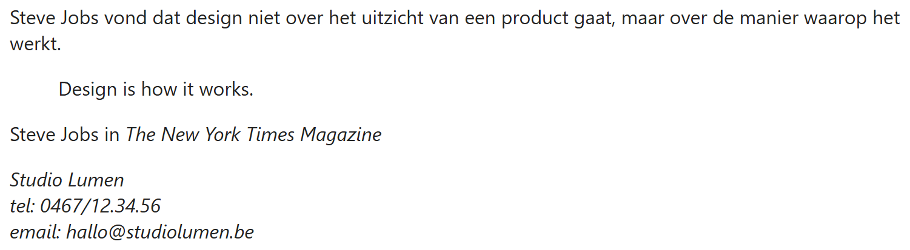
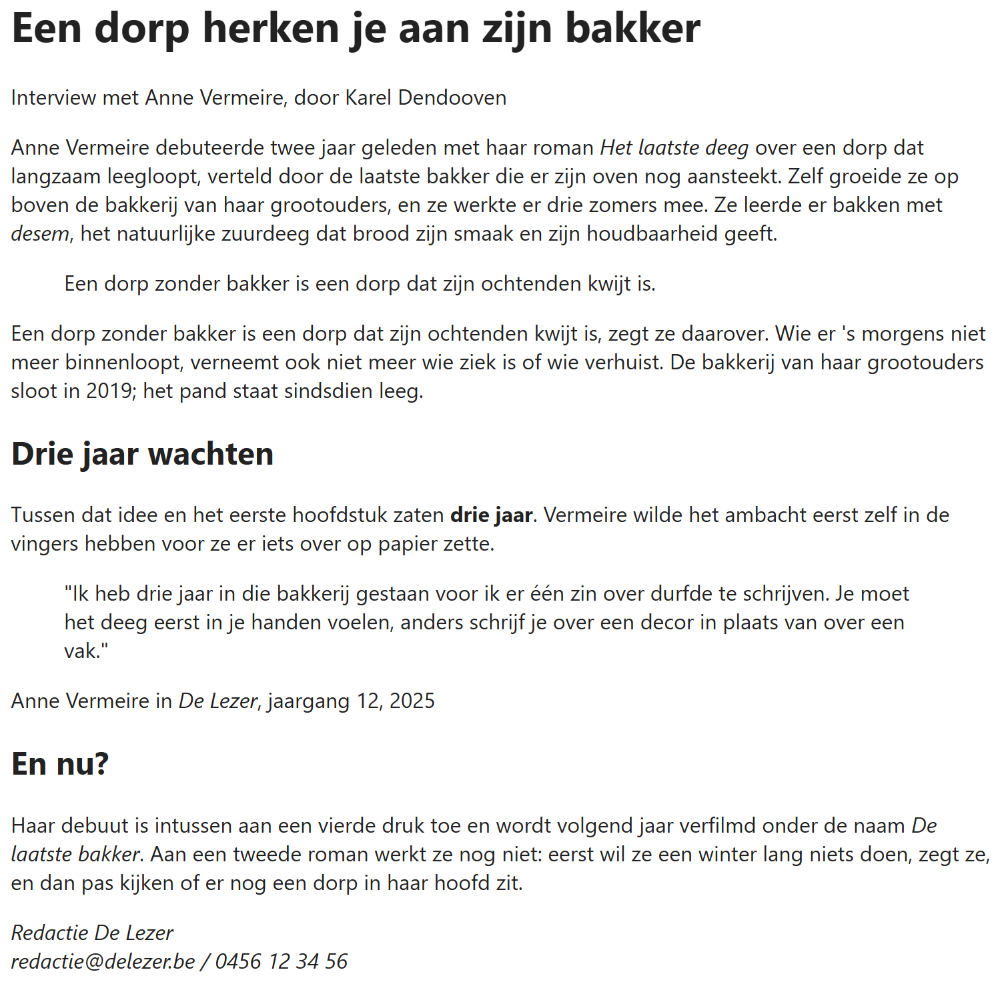

## Theorie

De uitgebreide uitleg vind je vanaf [https://rogiervdl.github.io/HTML-course/02_tekst.html#blockquote](https://rogiervdl.github.io/HTML-course/02_tekst.html#blockquote)

- `<blockquote>` – een **bloktekst**: een blok tekst die eruit springt, zoals een citaat van iemand anders of een pullquote in een artikel
- `<cite>` – een **bronvermelding**: bron waarnaar je refereert (boek, schilderij, rechtspraak, film, paper, song...), niet de naam van een persoon!
- `<address>` – de belangrijkste **contactgegevens** op een webpagina, meestal onderaan de pagina

Let op: `<address>` betekent dus niet "adres" maar "contactgegevens". Er hoeft zelfs geen echt adres in te staan; e-mail en telefoon is voldoende bv. Staan op meerdere plaatsen contactgegevens, kies dan de meest logische, meestal onderaan: `<address>` mag dus hooguit één keer per pagina voorkomen (net zoals `<h1>` en nog andere elementen).

```html
<p>
   Steve Jobs vond dat design niet over het uitzicht van een product gaat,
   maar over de manier waarop het werkt.
</p>
<blockquote>
   <p>Design is how it works.</p>
</blockquote>
<p>Steve Jobs in <cite>The New York Times Magazine</cite></p><!-- de bronvermelding, niet de spreker -->

<address>
   Studio Lumen<br>
   tel: 0467/12.34.56<br>
   email: hallo@studiolumen.be
</address>
```

Resultaat:



## Opdracht

Hieronder staat een interview uit een tijdschrift, als kale tekst. Geef elk stuk het element dat erbij hoort, naar voorbeeld van de screenshot. Let op: niet alles wat schuin staat is hetzelfde element.

### Screenshot



### Teksten

De teksten staan al klaar in de HTML.